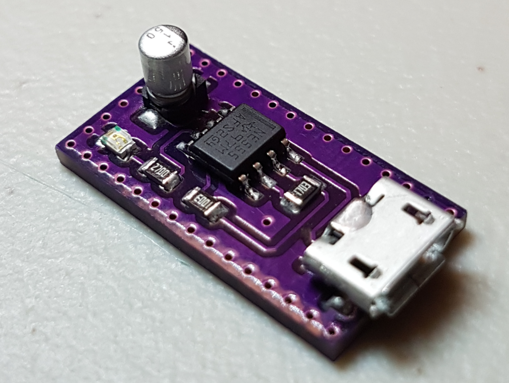
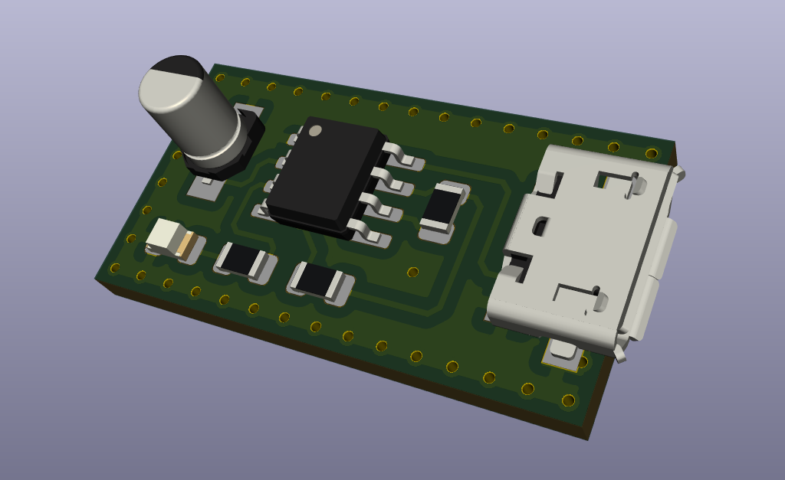
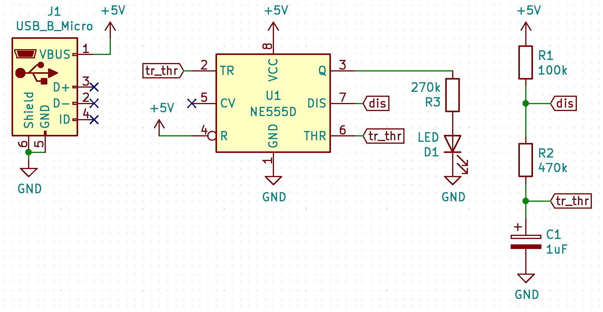
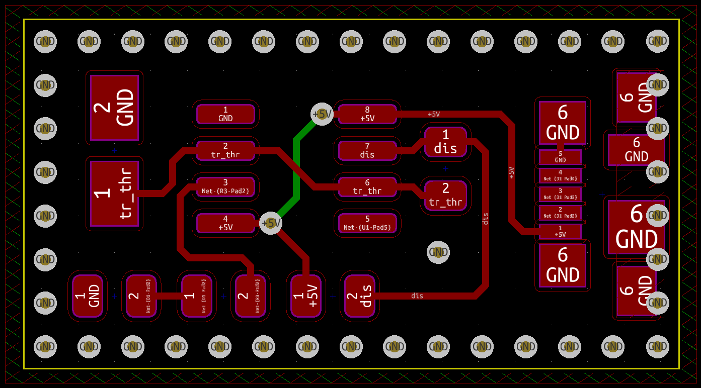

# flashing-led
Making PCB (printed circuit board) of a very popular electrical circuit that flashes an LED using a 555 timer IC.

[Demo video (.mp4 download link)](https://github.com/ItsKarlito/flashing-led/raw/master/media/demo.mp4)

**Circuit Schematic and PCB:**

**CAD Software:** 
[KiCad](https://www.kicad.org/)
