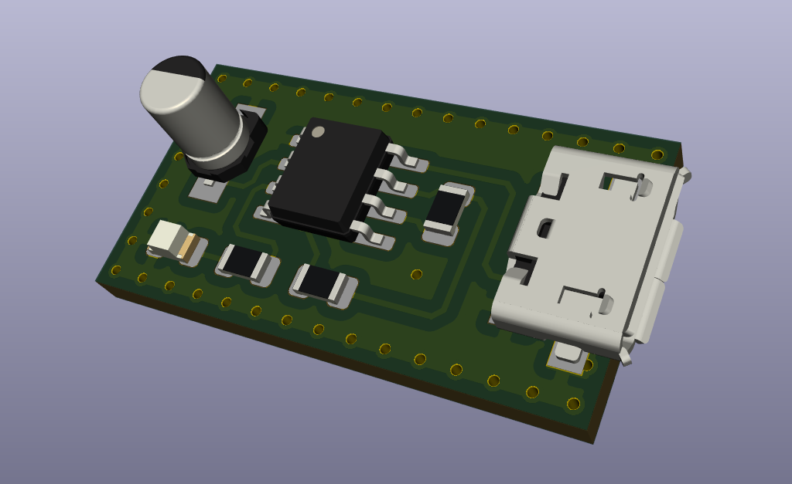
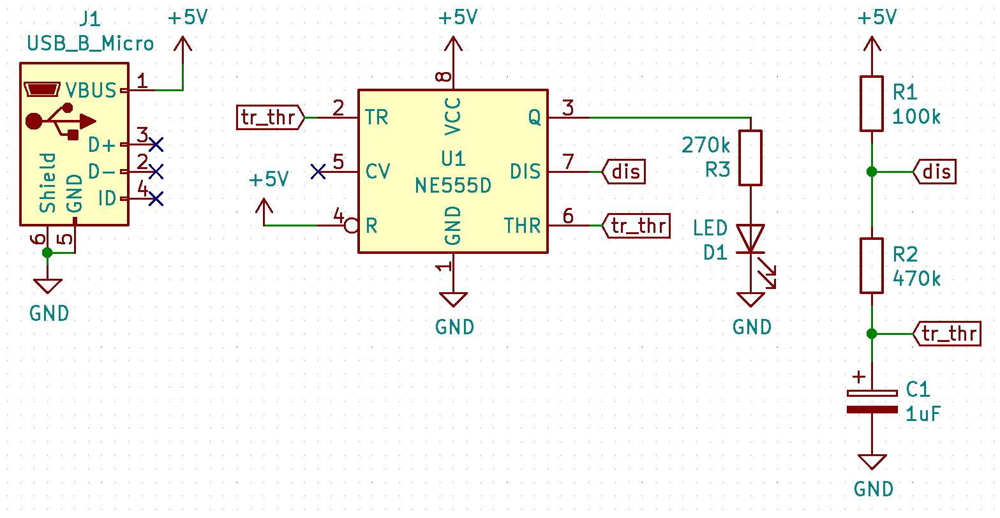
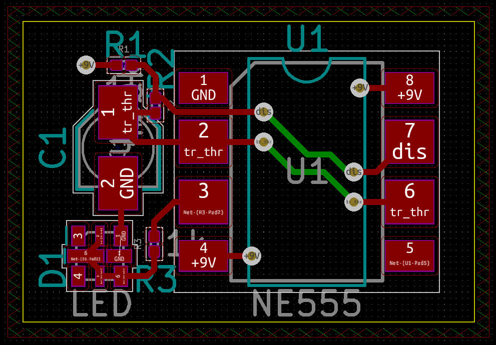

# flashing-led
Making PCB (printed circuit board) of a very popular electrical circuit that flashes an LED using a 555 timer IC.

**Circuit Schematic and PCB:**

**CAD Software:** 
KiCAD 5.1.6

Download Link: https://kicad-pcb.org/download/
